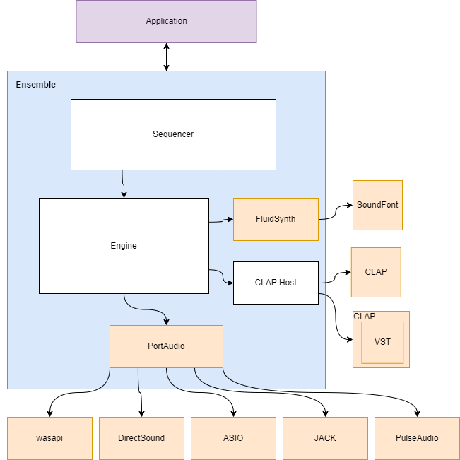

# ensemble

> <i>Je ne me souviens que d'un mur immense<br>
> Mais nous étions ensemble<br>
> Ensemble, nous l'avons franchi<br>
>
> I only remember an immense wall<br>
> But we were  together<br>
> Together we surmounted it<br></i>
>
> Ensemble by Jean-Jacques Goldman

Obtuse audio plugin frameworks and specious realtime constraints present an immense wall to music production in high-level languages. This project aims to surmount them.

# Implementation status

Short term goals are to support MIDI sequencing of Soundfonts and CLAP instruments, likely with offline rendering. Longer term goals are to develop higher level languages to support intelligent playback like [NotePerformer](https://www.noteperformer.com/). Realtime rendering is a lower priority since MIDI simply isn't intelligent enough. See [this vi-control post](https://vi-control.net/community/threads/is-it-time-for-sound-rendering.48604/post-4889885) for an explanation why.

## Architecture



## Modules

- [ ] sequencer
- [ ] Soundfont player (via [fluidsynth](https://www.fluidsynth.org/))
- [ ] CLAP plugin host (via [clap-hs](https://github.com/JBetz/clap-hs))
- [ ] VST plugin host
- [ ] audio I/O (via [portaudio](http://www.portaudio.com/))
- [ ] MIDI device routing

## API

See [ensemble.tl](./ensemble.tl) for a [Type Language](https://core.telegram.org/mtproto/TL) specification of the API.

There are two ways to interface with an ensemble server, via http or pipes.

<b>For pipes:</b> 
```bash 
./ensemble --interface pipes
```

Messages are sent by writing JSON to stdin, and responses are returned as JSON via stdout.

Example:

```bash
$ ./ensemble --interface pipes
{ "@type": "getAudioDevices", "@extra": 855818240 }
{ "@type":"AudioDevices", "@extra": 855818240, "audioDevices": [{"name": "Microsoft Sound Mapper - Input", "index": 0}, { "name": "Speakers (Realtek (R) Audio)","index": 1}]}
```

<b>For http:</b> 
```bash
./ensemble --interface http --port 3000
```

Messages are sent via POST requests to `localhost:<port>/send` with JSON in request body, and responses are returned as JSON in response body.


## Platforms

- [ ] unix
- [x] windows
