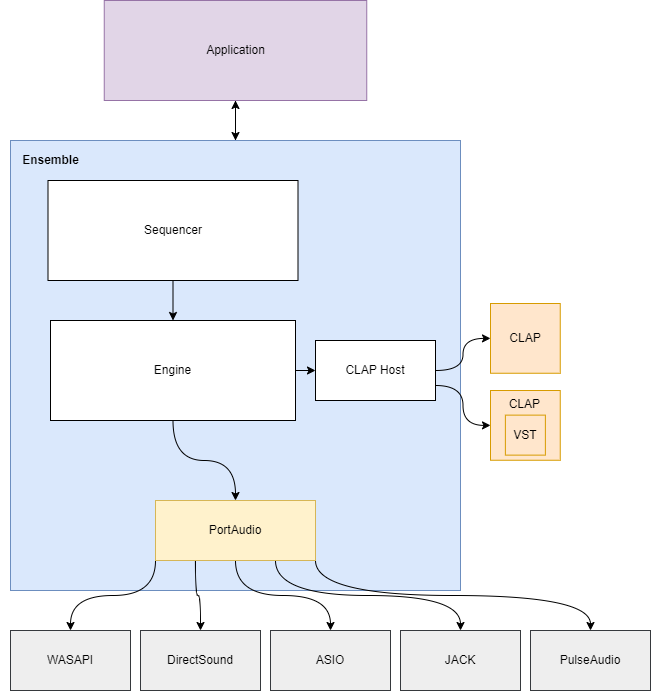

# ensemble

> <i>Je ne me souviens que d'un mur immense<br>
> Mais nous étions ensemble<br>
> Ensemble, nous l'avons franchi<br>
>
> I only remember an immense wall<br>
> But we were  together<br>
> Together we surmounted it<br></i>
>
> Ensemble by Jean-Jacques Goldman

Obtuse audio plugin frameworks and specious realtime constraints present an immense wall to music production in high-level languages. This project aims to surmount them.

# Implementation status

Short term goals are to support MIDI sequencing of CLAP instruments, with both offline and realtime rendering. Longer term goals are to develop higher level languages to support intelligent playback like [NotePerformer](https://www.noteperformer.com/). See [this vi-control post](https://vi-control.net/community/threads/is-it-time-for-sound-rendering.48604/post-4889885) for an explanation why MIDI alone is inadequate.

## Architecture



## Modules

- [x] sequencer
- [ ] CLAP plugin host (via [clap-hs](https://github.com/JBetz/clap-hs))
- [ ] VST plugin host
- [x] audio I/O (via [portaudio](http://www.portaudio.com/))
- [ ] MIDI device routing

## API

See [ensemble.tl](./ensemble.tl) for a [Type Language](https://core.telegram.org/mtproto/TL) specification of the API.

<b>To run a WebSocket server:</b>
```bash
./ensemble --interface websocket --port 3000
```

The WebSocket endpoint will be available at `localhost:<port>`, and the same rules for message tagging apply.

## Platforms

- [ ] unix
- [x] windows
